```{css, echo=FALSE}
a.em {
}
```


---

## Contents

* 3D Map Features and Spatial Modeling
  - 1.1. 3d Acoustic Propagation Modeling (ongoing)
  - 1.2. lab project: Extracting indoor details fromLIDAR

* Javascript Map API and Web Building
  - 2.1. Location based Theater and Movie finder

* Python Visualization and Spatial Optimization
  - 3.1. Fire Evacuation Maps (ongoing)
  - 3.2. Interactive map of Pareto Optimal solutions
  - 3.3. Finding Optimal Locations of Street Lights in LA

* Geo-statistical Analysis
  - 4.1. GWR, Spatio-Temporal Krigging, and Spline
  - 4.2. 2016 Presidential Election data analysis

---


## 1. 3D Map Features and Spatial Modeling


---

### 1.1. 3d Acoustic Propagation Modeling

#### [Ongoing]

- <i class="fas fa-book-open"></i>  [Presentation](data/Sound_Propagation_Model.pdf){target="_blank" class="em"}
- <i class="fas fa-desktop"></i> [Sourcecode](data/SoundPropagation.html){target="_blank" class="em"} : The sourcecode relies on arcpy module. The ipynb file should be operated within ArcGIS Pro, as an inserted Notebook.

<div class="warning" style='padding:0.1em; background-color:#E9D8FD; color:#69337A'>
<span>
<p style='margin-top:1em; text-align:center'>
<b>3d Acoustic Propagation Modeling</b></p>
<p style='margin-left:1em;margin-right:1em;'>

* This project is to model the sound propagation from the outdoor emergency sirens on the UCSB campus.
* The 3D building representation and detailed terrain elevation with vegetation height included were obtained from LIDAR pointcloud data.
* Each building has it's shape refined by using the <b>SketchUp</b> software. Building material and area of window information were added by the software, too.
</p>
</span>
</div>


<center>
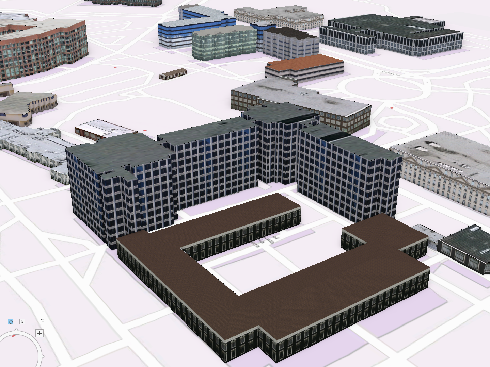
</center>

<div class="warning" style='padding:0.1em; background-color:#E9D8FD; color:#69337A'>
<span>
<p style='margin-left:1em;margin-right:1em;'>

* Firstly, a straight 3d sightline was used to delineate the shortest path between a siren and a receiver location.

* The 3d intersection points of the sightlines and buildings were used to calculate the diffraction effect. Though the diffraction path is not geometrically represented.

</p>
</span>
</div>


<center>
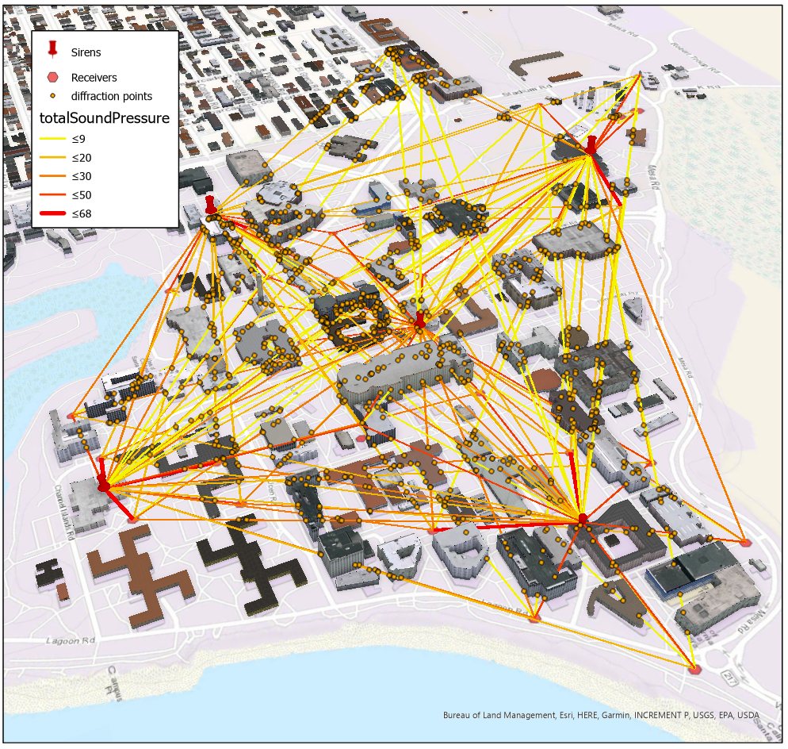
</center>

<div class="warning" style='padding:0.1em; background-color:#E9D8FD; color:#69337A'>
<span>
<p style='margin-left:1em;margin-right:1em;'>

* The table below includes the equations and corresponding sound effects. 
* They are used to calculate the decibel delivered to the receiver point from each siren. 
* The equations are from the ISO 9613 (with Joule’s Report edition), and NMPB 2008 models, and coded in Arcpy Python module.


</p>
</span>
</div>

<center>
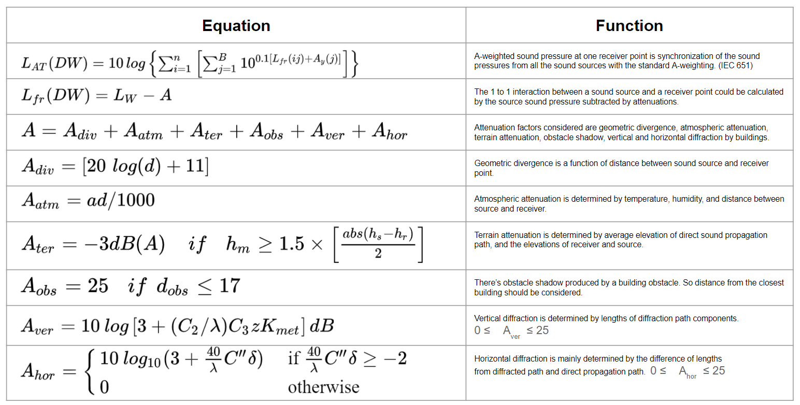
</center>


<div class="warning" style='padding:0.1em; background-color:#E9D8FD; color:#69337A'>
<span>
<p style='margin-left:1em;margin-right:1em;'>

* The plot below shows the sound propagation model result compared to the actual sound measurement at each receiver location. There were 29 receiver sample points. 
* The model result in the blue line corresponds with the oragne line, the measurement result very well. 
* The mean of the decibel difference was 0.64 and most of the observations were within the 95% confidence interval. 


</p>
</span>
</div>


<center>
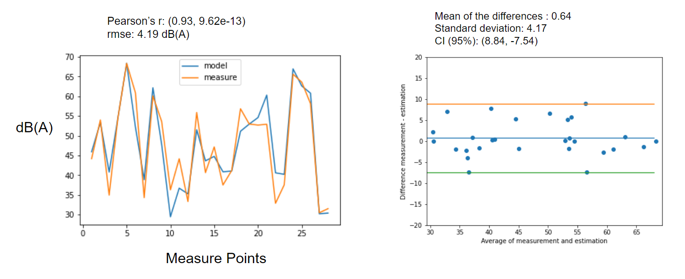
</center>


---


### 1.2. Extracting Indoor Details from LIDAR pointcloud
#### [Lab project]

* <i class="fas fa-book-open"></i> 
 [Presentation](data/lidar.pdf){target="_blank" class="em"}

<div class="warning" style='padding:0.1em; background-color:#E9D8FD; color:#69337A'>
<span>
<p style='margin-top:1em; text-align:center'>
<b>Extracting Indoor Details from LIDAR pointcloud</b></p>
<p style='margin-left:1em;margin-right:1em;'>
* This project is going on within my lab, so it's not my personal project.
* The indoor LIDAR point cloud is segmented and interpreted to read indoor objects. 
* Different types of Deep Neural Network models were tested.(Vanilla PointNet, PointNet, PointNet++) 
* 3D objects can be distinguished and labeled as a result.
* The project is halted due to lack of data. Indoor LIDAR pointcloud data is not sufficient and very often, it is not labeled.
</p>
</span>
</div>

<center>

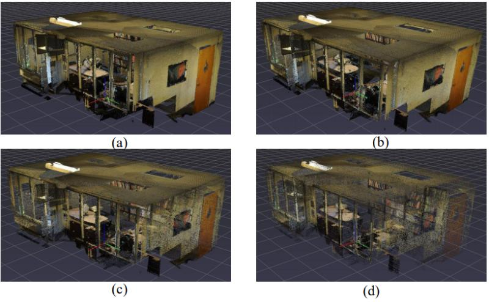

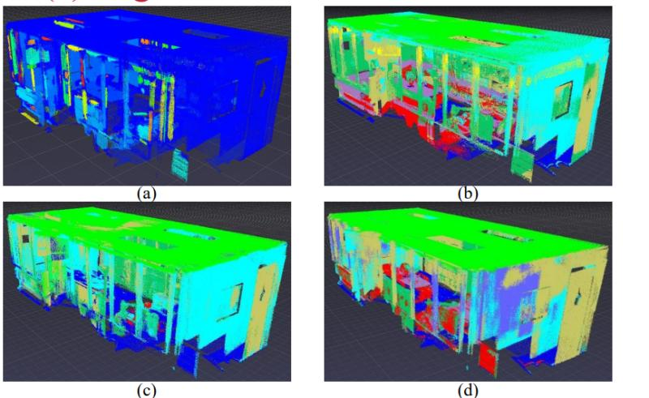

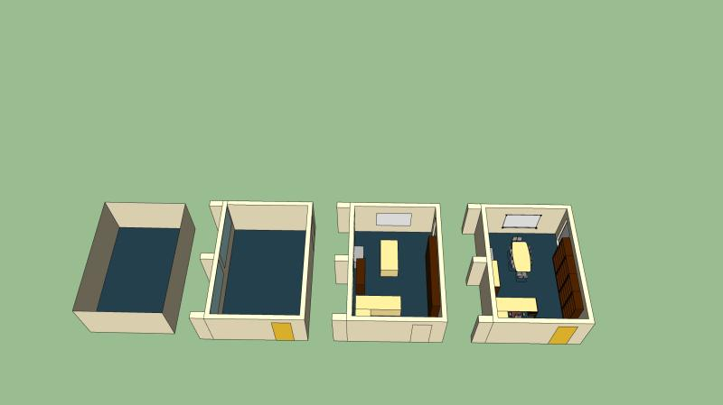

</center>

---

## 2. Javascript Map API and Web Building

---

### 2.1. Location based Theater and Movie finder

#### [2-people Team project]

- <i class="fas fa-box-open"></i> [MovieStock Website](https://moviestock.herokuapp.com/movies/){target="_blank" class="em"}: it takes a while to load as using free hosting by Heroku.
- <i class="fas fa-desktop"></i> [Sourcecode](){target="_blank" class="em"}

<div class="warning" style='padding:0.1em; background-color:#E9D8FD; color:#69337A'>
<span>
<p style='margin-top:1em; text-align:center'>
<b>Location based Theater and Movie finder</b></p>
<p style='margin-left:1em;margin-right:1em;'>
This sentence has five words. Here are five more words. Five-word sentences are fine. But several together bocome monotonous. Listen to what is happening. The writing is getting boring. The sound of it drones. It's like a stuck record. The ear demands some variety.<br><br>
    Now listen. I vary the sentence length, and I create music. Music. The writing sings. It has a pleasent rhythm, a lilt, a harmony. I use short sentences. And I use sentences of medium length. And sometimes when I am certain the reader is rested, I will engage him with a sentence of considerable length, a sentence that burns with energy and builds with all the impetus of a crescendo, the roll of the drums, the crash of the cymbals -- sounds that say listen to this, it is important.
</p>
</span>
</div>


<center>
<video width="480" height="320" controls>
  <source src="data/StreetLightAllocation.mp4" type="video/mp4">
</video>
</center>


---


## 3. Python Visualization and Spatial Optimization

#### [Ongoing]

---

### 3.1. Optimal Fire Evacuation Maps

#### [NSF funded project]


- <i class="fas fa-book-open"></i>   [Presentation](data/FireEvacuation_ppt.pdf){target="_blank" class="em"}
- <i class="fas fa-edit"></i> [Report](data/FireEvacuation_report.pdf){target="_blank" class="em"}

<div class="warning" style='padding:0.1em; background-color:#E9D8FD; color:#69337A'>
<span>
<p style='margin-top:1em; text-align:center'>
<b>Optimal Fire Evacuation Maps</b></p>
<p style='margin-left:1em;margin-right:1em;'>
* This project is funded by National Science Foundation(NSF).
* There are two models being built upon this project. One is the spatial optimization model finding the optimal evacuation process of a given region. Another is Agent Based Model describing messy, real-world evacuation process.
* Currently, optimization model is done, but Agent Based Model part is on-going.
* The road network of a study region (Mission Canyon, Santa Barbara) is automatically processed from the raw dataset obtained from OpenStreetMap using Python only. 
</p>
</span>
</div>

<center>
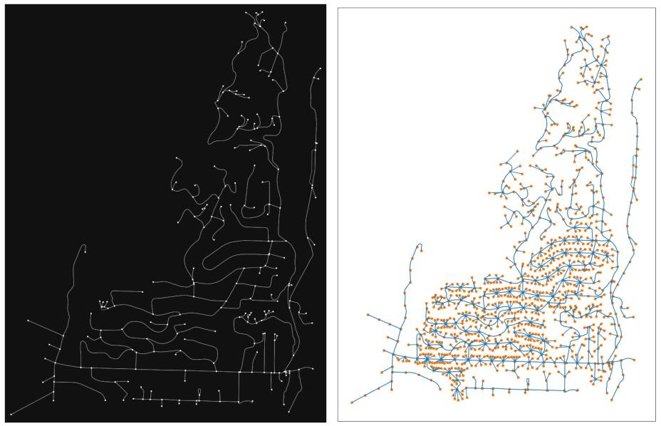
</center>

<div class="warning" style='padding:0.1em; background-color:#E9D8FD; color:#69337A'>
<span>
<p style='margin-left:1em;margin-right:1em;'>
* The GIF below shows the optimal evacuation process of the Mission Canyon region. 
* The flow of each road segment is optimized assuming that each driver takes the best way considering the status of the whole road network. (which is unrealistic, sothat optimized)
</p>
</span>
</div>

```{r echo=FALSE}
knitr::include_graphics("data/1_staggered.gif")
```


---

### 3.2. Interactive map of Pareto Optimal solutions

* <i class="fas fa-book-open"></i>   [Presentation](data/thesistalk.pdf){target="_blank" class="em"}
* <i class="fas fa-desktop"></i> [Sourcecode](data/swain_sourcecode.html){target="_blank" class="em"}
* <i class="fas fa-book-open"></i>  [Interactive Map](data/swain_solutions.html){target="_blank" class="em"}

<div class="warning" style='padding:0.1em; background-color:#E9D8FD; color:#69337A'>
<span>
<p style='margin-top:1em; text-align:center'>
<b>Interactive map of Pareto Optimal solutions</b></p>
<p style='margin-left:1em;margin-right:1em;'>
* This project defines a brand-new bi-objective spatial optimization problem and solves it exactly (not heuristic). 
* Rather than using a mathematical solver, open-source libraries in Python with spatial insights were used to solve the bi-objective optimization problem.
* The solution algorithm developed in this project finds all of the non-dominated solutions. In other words, 100% of pareto optimal solutions can be found
* The chart of the left side shows the distribution of the solutions. Non-dominated, pareto optimal solutions were depicted as blue squares. Dominated, non-optimal solutions were depicted as grey dots. 
* The map on the right side shows the location of demand points(green circles), and solutions.
</p>
</span>
</div>


[](data/swain_solutions.html)


<div class="warning" style='padding:0.1em; background-color:#E9D8FD; color:#69337A'>
<span>
<p style='margin-left:1em;margin-right:1em;'>
* In the figure, the greater the x-axis, TWD(Total Weighted Distance) means, the larger the average distance to all the demand locations. So less value would be a better solution considering accessibility to the demands. 
* greater value on the y-axis, COV(Coverage) means, more demands are within the coverage bound. So greater value would be a better solution.
* Worse solutions tend to have a darker color, and the spatial pattern of the inferior and superior solutions can be witnessed in the figure.
</p>
</span>
</div>

[](data/swain_solutions.html)

---

### 3.3. Finding Optimal Locations of Street Lights in LA
- <i class="fas fa-desktop"></i> [Sourcecode](data/StreetLightAllocation.html){target="_blank" class="em"}: Interactive maps can be found within the sourcecode
- Detailed explanation with the sourcecodes can be found within the video below.

<center>
<video width="480" height="320" controls>
  <source src="data/StreetLightAllocation.mp4" type="video/mp4">
</video>
</center>


<div class="warning" style='padding:0.1em; background-color:#E9D8FD; color:#69337A'>
<span>
<p style='margin-top:1em; text-align:center'>
<b>Finding Optimal Locations of Street Lights in LA</b></p>
<p style='margin-left:1em;margin-right:1em;'>
* The classic spatial optimization, Anti-Covering Location Problem was applied to the case of LA street Lights.
* The problem was solved by using Gurobi-Py solver, so coded in Python language.
* The project was seeking to find the optimal locations of street lights to cover the most floating population with the minimum number of street lights.
</p>
</span>
</div>

<center>


</center>

<div class="warning" style='padding:0.1em; background-color:#E9D8FD; color:#69337A'>
<span>
<p style='margin-left:1em;margin-right:1em;'>
* The result map on the left side shows the type of roads with differently colored lines. The yellow circles along the lines are street lights.
* The chart on the right side shows the average distance between street lights on each road type and how much demand on the road was covered. The vertical lines represent desirable distance between street lights according to different road types suggested by City Planning Department of LA.
</p>
</span>
</div>


[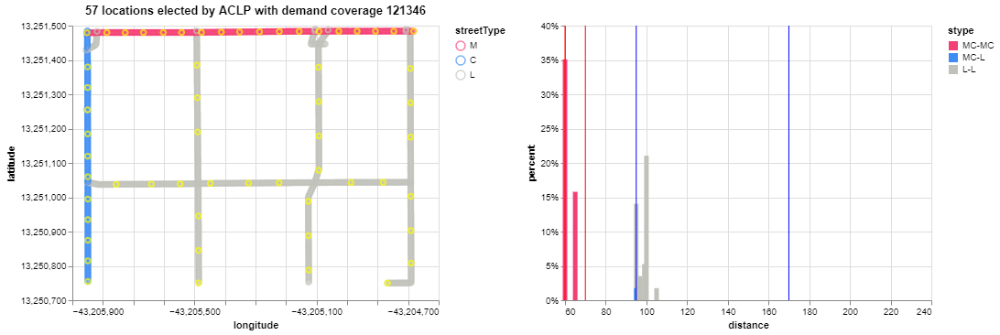](data/StreetLightAllocation.html){target="_blank"}


---


---

## 4. Geo-Statistical Analysis

---

### 4.1. GWR, Spatio-Temporal Krigging, and Spline

#### [4-people Team project]

- <i class="fas fa-edit"></i> [Report](data/GWR_Spline.pdf){target="_blank" class="em"}


<div class="warning" style='padding:0.1em; background-color:#E9D8FD; color:#69337A'>
<span>
<p style='margin-top:1em; text-align:center'>
<b>GWR, Spatio-Temporal Krigging, and Spline</b></p>
<p style='margin-left:1em;margin-right:1em;'>
* This project was to apply three different geo-statistical methods to a large remotely sensed dataset to explain the spatial distribution of air pollutant, $PM_{2.5}$.
* Linear Mixed Effect Model was used as the primary method to predict $PM_{2.5}$ values. Then, for the residuals, geo-spatial models were applied to take spatial context into account. 
* I took three parts. Spatio-Temporal Krigging, Spatil Leave One Out Cross-Validations(LOOCV), and map plotting parts. All the maps and plots in the [Report](data/GWR_Spline.pdf) were created by me.
* The plot below shows the different types of variogram model considered to fit Spatio-Temporal Krigging model to the dataset. SumMetric model is selected, because it had the least mean absolute error compared to the sample variogram.
</p></span>
</div>

<center>
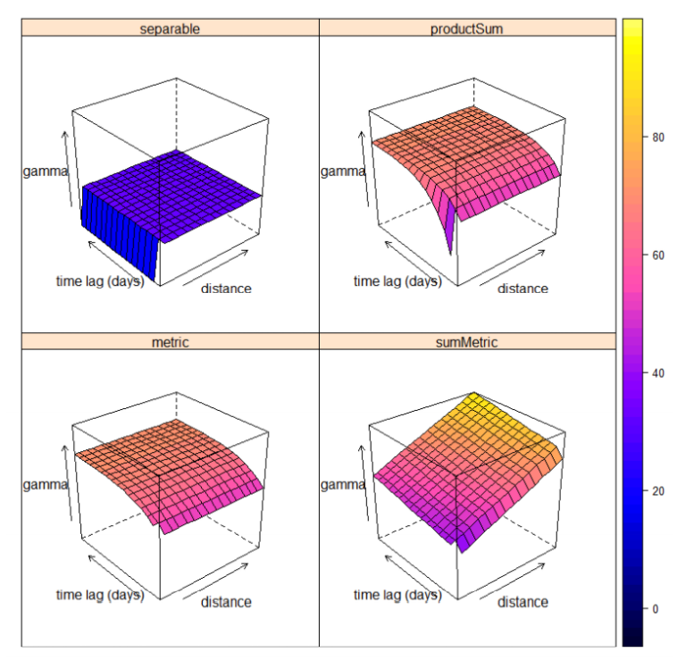
</center>

<div class="warning" style='padding:0.1em; background-color:#E9D8FD; color:#69337A'>
<span>
<p style='margin-left:1em;margin-right:1em;'>
* The result maps show the spatial distribution of the predicted residuals of $PM_{2.5}$. 
* Geographically Weighted Regression (GWR) shows much abrupt changes, which makes sense considering the mathematical structure of it. GWR heavily relies on the observation locations.
* Spline shows rather smooth changes regarding the physical, environmental explanation.
* Spatio-Temporal Krigging method predictions and error
estimates follow exactly the spatial patterns of the explanatory variable.
</p></span>
</div>

<center>

</center>

<div class="warning" style='padding:0.1em; background-color:#E9D8FD; color:#69337A'>
<span>
<p style='margin-left:1em;margin-right:1em;'>
* Considering different metrics to measure the performance of each model, it is concluded that Spline does the best to delineate the spatial distribution of the prediction residuals of $PM_{2.5}$.
</p></span>
</div>

<center>

</center>

<div class="warning" style='padding:0.1em; background-color:#E9D8FD; color:#69337A'>
<span>
<p style='margin-left:1em;margin-right:1em;'>
* The Spatial Leave One Out Cross-Validations (LOOCV) were done on the sampling locations with multiple observations at different times.
* The R2 values from Leave One Out Cross Validation of each model is presented below. The red color and smaller size of each point represent lower R2 value, and yellow and larger size of each point represent higher R2 value.
* The locations at the edge of the map tended to have lower R2 values compared to the other sites.
* All models performed better in more urban areas with more clustered observation locations. So, the approach of incorporating more sampling locations out of the real area of interest was effective.

</p></span>
</div>


<center>

</center>


### 4.2. 2016 Presidential Election data analysis

#### [2-people Team project]

- <i class="fas fa-desktop"></i> [Sourcecode](data/2016ElectionCodes.html){target="_blank" class="em"}
- <i class="fas fa-edit"></i> [Report](data/2016ElectionReport.pdf){target="_blank" class="em"}


<div class="warning" style='padding:0.1em; background-color:#E9D8FD; color:#69337A'>
<span>
<p style='margin-top:1em; text-align:center'>
<b>2016 Presidential Election data analysis</b></p>
<p style='margin-left:1em;margin-right:1em;'>


</p></span>
</div>

<center>

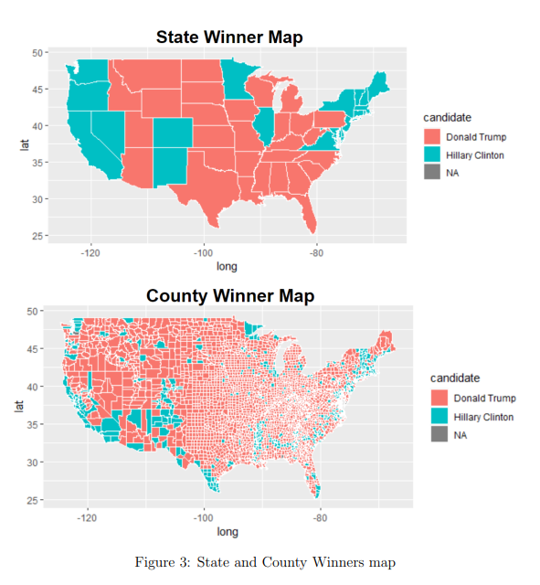
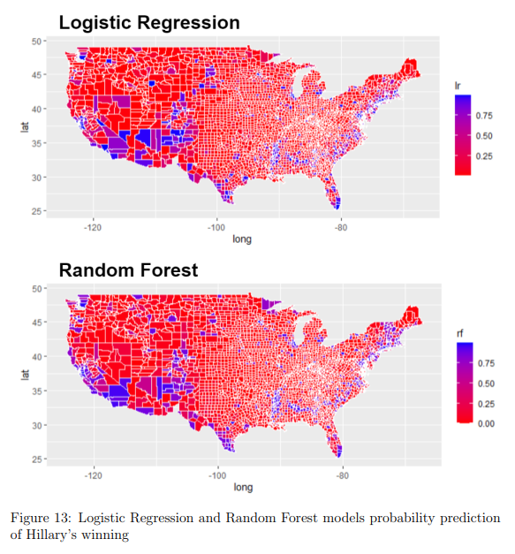
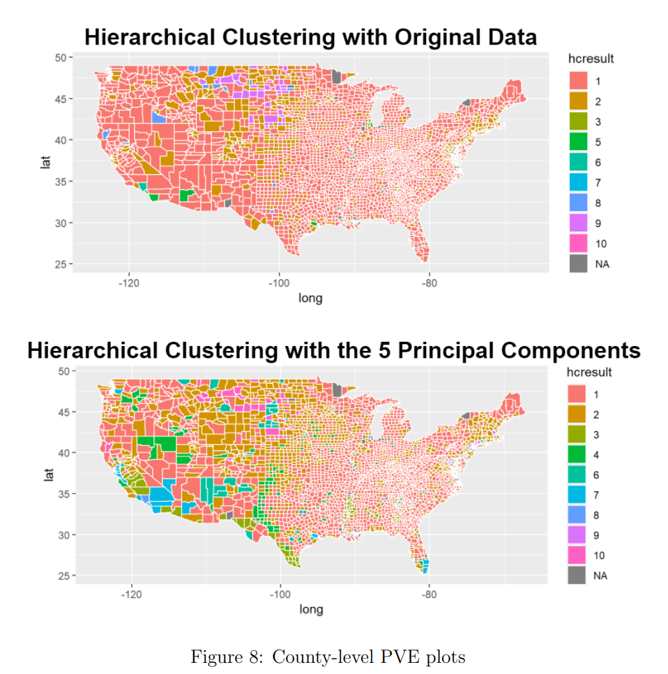

</center>