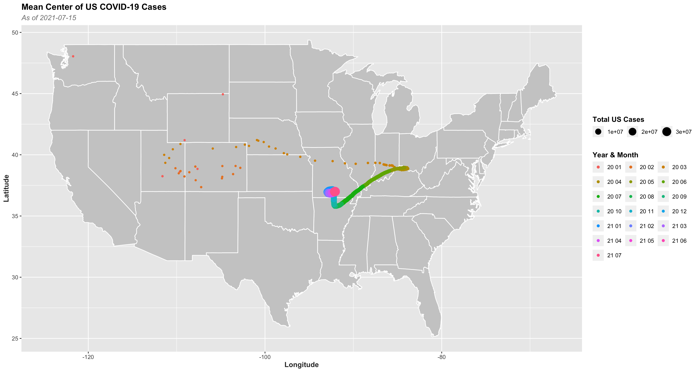
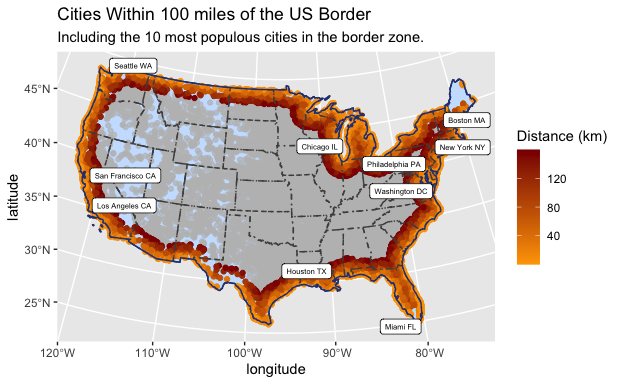
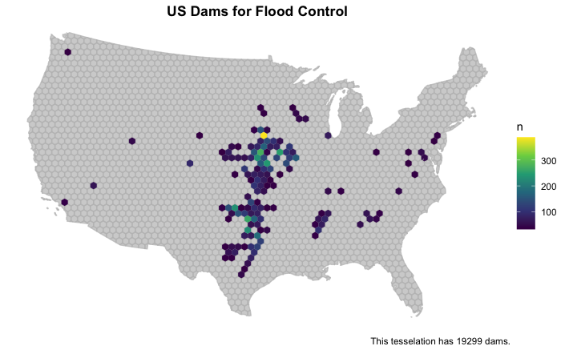
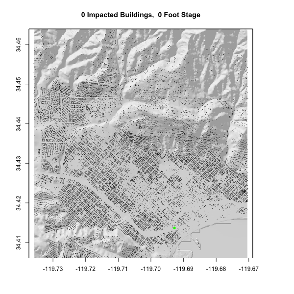

---

<center>
</center>

## Geog13 2021 and GEOG 176A 2020
#### Instructor: Mike Johnson 
#### TA: Jiwon Baik

- TAed for the class leading students to make the first project in the GIS programming class using R.
- Students to be familiar with R and Rstudio: what the basic logic is, and how to use it.
- create a brief personal website using R and Github, that everyone visits it online easily.
- Make a good start on Geographic Information Science! 

---

## 1. COVID-19 Data Wrangling

* [sourcecode](https://jiwonbaik96.github.io/geog-13-labs/lab-02.html){target="_blank"}


<div class="warning" style='padding:0.5em; background-color:#DAF2D3; color:#478432'>
<span>
<p style='margin-top:1em; text-align:center'>
<b>COVID-19 Data Wrangling</b></p>
<p style='margin-left:1em;'>

In the **lab02**, I worked with COVID-19 data in US, monitoring California's daily new cases, plotting 4 interesting states' changes of cases, and evaluating the pandemic trending on space and time. Here is the link of workflow.

<br> 

- Students got familiar with Rstudio gradually from practices, for instance, analyzing raw data with packages and plotting, combination of raw data, and extracting the variables from raw data.
- Students used New York Times COVID-19 Data and USDA Population Data to analyze cases of the virus
across U.S. counties, working primarily with daily new cases, total case counts, state rolling 7-day mean cases, and cases per capita.
- Students wrote programmatic requests to enable the data to update with daily additions made to the url of supporting COVID-19 data.
- Students mapped the migration of the weighted mean coordinate locations of COVID-19 cases through time, scaling the mean center points with nationwide cumulative cases in relation to the current case counts.

</p>
</span>
</div>


]

---


## 2. Distances and the Border Zone

* [sourcecode](https://jiwonbaik96.github.io/geog-13-labs/lab-03.html){target="_blank"}

<div class="warning" style='padding:0.5em; background-color:#DAF2D3; color:#478432'>
<span>
<p style='margin-top:1em; text-align:center'>
<b>Distances and the Border Zone</b></p>
<p style='margin-left:1em;'>

In the **lab03**, I figured out the geographic relationship between US cities and borders of national, states, and near countries. Then I evaluated the 100-mile Border Zone described in [ACLU article](https://www.aclu.org/other/constitution-100-mile-border-zone){target="_blank"}.

<br>


- Students worked with spatial (sf) objects and coordinate systems and converted from MULTIPOLYGON to MULTILINESTRING geometries, in order to visualize country and state borders.
- Students wrote functions to hasten coding that involved repeated use of the same code.
- Students learned to use gghighlight to show only the pertaining data in color and lty to create dashed boundaries.


</p>
</span>
</div>

Here is my highlight in the project:


---

In the **lab04**, I started to analyze the geographic points in the polygon, with the functions defined by myself. With the raw data of dams in the United States, I tried to find the relationship between the dam distribution and geographic information. 

## Tesselations, Point-in-Polygon

- Students created tessellated surfaces of US county centroids and grid coverages intersected to the boundaries of the contiguous United States.
- Using data from the US Army Corp of Engineers' National Dam Inventory (NID), Students mapped the spatial distribution of dams in the tessellations, noting that tile size can be deceptive (see: [The Modifiable Areal Unit Problem (MAUP)](https://www.gislounge.com/modifiable-areal-unit-problem-gis/))
- Students created point-in-polygon visualizations for dams of specific purposes, such as recreation and flood control.


Here is my highlight in the project:
[](https://jiwonbaik96.github.io/geog-13-labs/lab-04.html){target="_blank" title="click this image to open sourcecode"}

---

In the **lab05**, we learned to use raster layers to analyze the continuous data, a case of flooding in Palo, Iowa. We used the raster pacakge and raster data knowledge to create flood images using multiband Landsat Imagery, thresholding and classification methods.

## Raster and Remote Sensing

- First time I deal with the continuous data with raster data model, and map algebra to analyze elevation, precipitation, and climate.
- In the case of Palo, I use kmean-rasters compared with Landsat band calculating the flooding cells shared by each layers. 
- And I extracted a specific location captured by the drone from layers to define its value in the raster data.

Here is my highlight in the project:
```{r echo=FALSE}

```


---

In the **lab06**, terrain analysis is managed by R coding. We chose Mission Creek's flood event in 2017 as object, estimating the number of buildings impacted. In the project, I completed the whole analysis from collecting data to the assessment of impacts.


