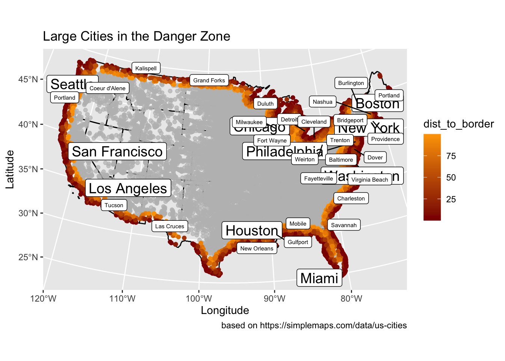

```{css, echo=FALSE}
.spoiler {
  visibility: hidden;
}

.spoiler::before {
  visibility: visible;
  content: "Spoiler alert! Hover me to see the answer."
}

.spoiler:hover {
  visibility: visible;
}

.spoiler:hover::before {
  display: none;
}
```


---

<center>
</center>

## Geog13 2021 and GEOG 176A 2020
#### instructor: Mike Johnson 
#### TA: Jiwon Baik

- TAed for the class leading students to make the first project in the GIS programming class using R.
- Students to be familiar with R and Rstudio: what the basic logic is, and how to use it.
- create a brief personal website using R and Github, that everyone visits it online easily.
- Make a good start on Geographic Information Science! 

---

In the **lab02**, I worked with COVID-19 data in US, monitoring California's daily new cases, plotting 4 interesting states' changes of cases, and evaluating the pandemic trending on space and time. Here is the link of workflow.

## COVID-19 Data Wrangling

- I was familiar with Rstudio gradually from practices, for instance, analyzing raw data with packages and plotting, combination of raw data, and extracting the variables from raw data.
- In the COVID-19 data wrangling, I started to realize the relationship among data. Data will be influenced by other variables, chronologically and spatially. 
- The structure of the code is important too. Well-structured code is easier to debug and present.

Here is my highlight in the project:
[](https://jiwonbaik96.github.io/geog-13-labs/lab-02.html){target="_blank" title="click this image to open sourcecode"}

---

In the **lab03**, I figured out the geographic relationship between US cities and borders of national, states, and near countries. Then I evaluated the 100-mile Border Zone described in [ACLU article](https://www.aclu.org/other/constitution-100-mile-border-zone){target="_blank"}.

## Distances and the Border Zone

- I learned how to build sf objects from R packages and CSVs, using computer to program the projection which studied in the Geog w12.
- In the project, I understand the calculation of distance between geographic objects, such as point, line string and area.
- And I can plot clear map with distance data by ggplot.

Here is my highlight in the project:
[](https://jiwonbaik96.github.io/geog-13-labs/lab-03.html){target="_blank" title="click this image to open sourcecode"}

---

In the **lab04**, I started to analyze the geographic points in the polygon, with the functions defined by myself. With the raw data of dams in the United States, I tried to find the relationship between the dam distribution and geographic information. 

## Tesselations, Point-in-Polygon

- I understand how the tessellation works. Each tessellation has its own advantages and disadvantages, and different attributes. 
- I analyze the dams data in the United States with the voronoi tessellation, defining the numbers of dam in each tiles. With the distribution of different types, I demonstrate the possible reasons of the distribution.
- And the leaflet map also be drawn, showing in largest and high_hazard dam in each state with Mississippi River System.

Here is my highlight in the project:
[](https://jiwonbaik96.github.io/geog-13-labs/lab-04.html){target="_blank" title="click this image to open sourcecode"}

---

In the **lab05**, we learned to use raster layers to analyze the continuous data, a case of flooding in Palo, Iowa. We used the raster pacakge and raster data knowledge to create flood images using multiband Landsat Imagery, thresholding and classification methods.

## Raster and Remote Sensing

- First time I deal with the continuous data with raster data model, and map algebra to analyze elevation, precipitation, and climate.
- In the case of Palo, I use kmean-rasters compared with Landsat band calculating the flooding cells shared by each layers. 
- And I extracted a specific location captured by the drone from layers to define its value in the raster data.

Here is my highlight in the project:
[](https://jiwonbaik96.github.io/geog-13-labs/lab-05.html){target="_blank" title="click this image to open sourcecode"}

---

In the **lab06**, terrain analysis is managed by R coding. We chose Mission Creek's flood event in 2017 as object, estimating the number of buildings impacted. In the project, I completed the whole analysis from collecting data to the assessment of impacts.


